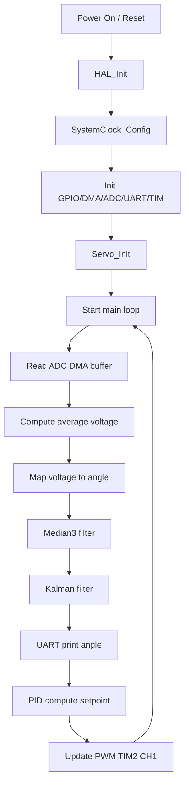
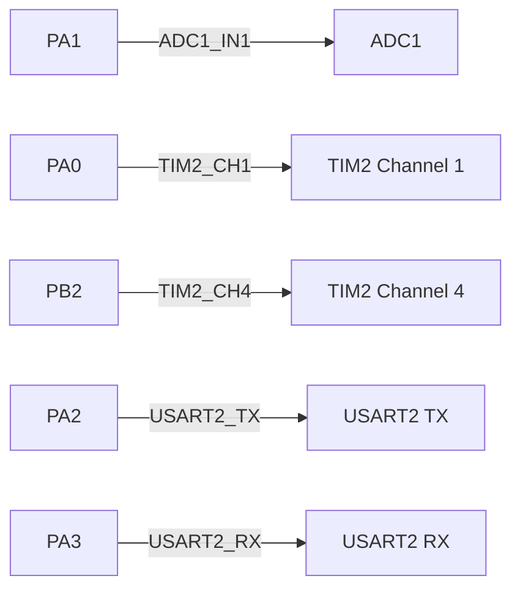

# Servo Control on ESP32 (ADC + PWM + Filters + micro-ROS)

This project targets the ESP32 (upesy_wroom) and implements a closed-loop servo controller using ADC feedback, PWM output, and a hybrid Median + Kalman filter. It is built with PlatformIO and integrates with ROS2 via micro-ROS.

## Overview

- **MCU**: ESP32 (Dual-core Xtensa LX6, 240MHz)
- **Control**: PID loop driving a servo via PWM (LEDC peripheral)
- **Feedback**: ADC with software averaging (20 samples)
- **Filtering**: 3‑tap median filter + 1D Kalman filter (auto `dt` via `millis()`)
- **ROS Integration**: micro-ROS with publishers/subscribers
- **Architecture**: Dual-core FreeRTOS (Core 0: control loop @ 100Hz, Core 1: ROS communication @ 20Hz)

Key logic lives in:
- `lib/Servo_lib/servo_control.cpp` - Servo control and ADC feedback
- `lib/filter_lib/filter_lib.cpp` - Median + Kalman hybrid filter
- `lib/pid_lib/pid_lib.cpp` - PID controller with anti-windup
- `lib/brushless_lib/brushless_control.cpp` - Brushless motor ESC control
- `src/main.cpp` - Main control loop and micro-ROS integration

## Build

Make sure the ARM GCC toolchain is installed and in PATH:

```bash
make clean && make
```

Artifacts are written to `build/`:
- `build/test_multi_adc_pwm.elf`
- `build/test_multi_adc_pwm.hex`
- `build/test_multi_adc_pwm.bin`

- Additional developer guidance is provided in `CLAUDE.md`.


## Flash

Use PlatformIO to upload to ESP32:

```bash
# Upload via USB (auto-detect port)
pio run --target upload

# Specify port manually if needed
pio run --target upload --upload-port /dev/ttyUSB0

# Upload and open serial monitor
pio run --target upload && pio device monitor
```

## Runtime Behavior

The firmware implements a dual-core architecture:

**Core 1 (APP_CPU) - ROS Communication:**
- Initializes micro-ROS connection to agent
- Subscribes to `/steering_command` and `/throttle` topics
- Publishes `/steering_angle` feedback at 20Hz
- Handles agent connection/disconnection

**Core 0 (PRO_CPU) - Control Loop @ 100Hz:**
- Reads ADC feedback from servo position sensor
- Applies hybrid filter (Median + Kalman)
- Computes PID control output
- Drives servo PWM and brushless motor ESC
- Stops motors when agent disconnects (safety feature)

## Control Flow



## Configuration

Tune system behavior in `config/` directory:

- `config/servo_config.h`
  - PWM pulse width limits (500-2000μs)
  - PID gains (Kp, Ki, Kd)
  - ADC resolution and voltage mapping
  - Sample averaging count

- `config/filter_config.h`
  - Kalman filter noise parameters (Q_angle, Q_vel, R_meas)

- `config/pins_config.h`
  - GPIO pin assignments for servo, ESC, and ADC

- `config/esp32_config.h`
  - CPU clock speed (240MHz)
  - ADC resolution (12-bit)
  - ADC attenuation (11dB for 0-3.3V range)

## Hardware Notes

- ADC feedback is expected on **ADC1_IN1** (PA1)
- PWM output uses **TIM2 CH1** (PA0) – TIM2 CH4 is on PB2 (available but not used for servo)
- UART debug uses **USART2** (TX: PA2, RX: PA3)

### Pinout Diagram



Pin mappings and peripheral configuration can be inspected/edited in the STM32CubeMX project file `test_multi_adc_pwm.ioc`.

## All Used Pins and Configuration

| Pin | Port | Function | Mode | Alternate Function / Details |
|-----|------|----------|------|--------------------------------|
| PA0 | A | PWM output for servo (TIM2_CH1) | Alternate Function Push‑Pull | AF1 (TIM2) |
| PB2 | B | PWM output for brushless ESC (TIM2_CH4) | Alternate Function Push‑Pull | AF1 (TIM2) |
| PA1 | A | ADC input for feedback (ADC1_IN1) | Analog | – |
| PA2 | A | UART TX (USART2) | Alternate Function Push‑Pull | AF7 (USART2) |
| PA3 | A | UART RX (USART2) | Alternate Function Push‑Pull | AF7 (USART2) |


## Troubleshooting

- **Header not found on Linux**: Ensure include paths in `Makefile` match folder case. The filter driver folder is `STM32F4XX_Filter_Driver` (uppercase `XX`).
- **No UART output**: Check USART2 pins, baud rate, and terminal settings.
- **No servo movement**: Verify PWM output pin, power, and servo voltage range.
